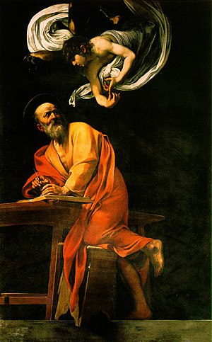

Caravaggio is an amazing artist. While his art alone speaks to his skill, it doesn't tell of the colorful life he lived.

He was different from the standard artist like Leonardo da Vinci, Botticelli, or Michelangelo. He
liked to drink and fight, and was a infamous figure. He refused to not cooperate with anyone, but
people kept buying his art for it's sheer skill. Eventually his home city of Florence grew tired and
threw him out.

Hidden in Rome is a relatively unassuming Church. Inside are some of his amazing works.

<br>

<style>
.html-widget {
    margin: auto;
}
</style>
```{R, echo=FALSE, fig.align="center", fig.cap="**Fig.1** Leaflet map showing the location of a unassuming Church. To be fair, there are many unassuming Churches and buildings in Italy holding artistic wonders."}
library(leaflet)
my_map <- leaflet() %>%
    addTiles(group = "OSM",
             options = providerTileOptions(minZoom = 16, maxZoom = 17)) %>%
#    setView(41.899623, 12.474565, zoom = 15)
    addMarkers(lat=41.899623, lng=12.474565,
               popup="The Inspiration of Saint Matthew. https://en.wikipedia.org/wiki/San_Luigi_dei_Francesi") %>%
    addProviderTiles("Stamen.TonerLite",
                                group = "Toner",
                                options = providerTileOptions(minZoom = 16, maxZoom = 17))
my_map %>% addProviderTiles(providers$Stamen.Watercolor)
```
<br>

The image below is taken from the wikipedia page for [The Inspiration of Saint Matthew](https://en.wikipedia.org/wiki/The_Inspiration_of_Saint_Matthew), and is one of three hanging in the Church.

<br>

<center>
[](https://en.wikipedia.org/wiki/The_Inspiration_of_Saint_Matthew)
</center>
<center>
**Fig.2** The Inspiration of Saint Matthew
</center>

<br>

What He is known best for is the striking palette in his art. There is a distinct difference in his
use of light and dark (chiascuro) which is matched by only a few artists in history. Goya, who also
has mastery of chiascuro, makes use of an overall darker palette. I would argue that Caravagio gives
colour emphasis through his use of dark, while Goya uses black as a primary colour.

<br>
<br>
<br>
<br>
